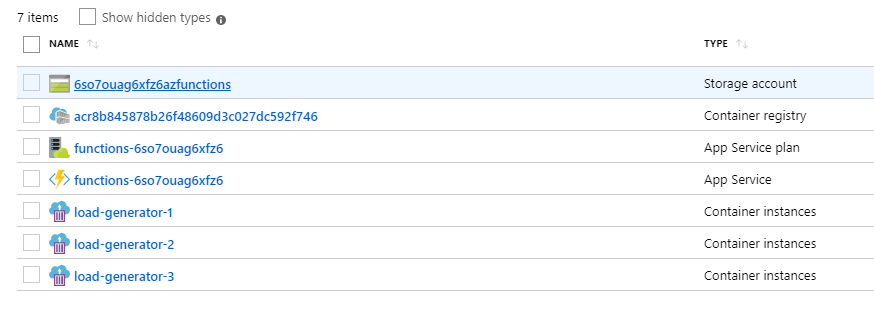

# Azure ACI load generator

It is common issue that in other hand load testing can give great value
and in other hand it's often very expensive and time consuming to setup.
This repository tries to solve that issue in generic way by using Azure
container instances to spawn large array of load generators running in
containers.

Anything that can be ran on containers can be used as load generator. For
example Selenium, JMeter, k6s.io, Puppeteer or Cypress.

Usually easiest way to generate more or less realistic load to system is
via user interface. However tools like Selenium are slow and require lots
of resources since they run browser on background. This problem can be
worked around to spawn a lot of concurrent instances in ACI.

If you spawn array for longer period of time, this tool can also be used
to generate data to target instance. Commonly issues starts to arise when
there's enough data in system.

## Setup environment and dependencies

Should be executable with Windows, Mac and Linux with following dependencies installed:

- [Powershell 6.2+](https://github.com/PowerShell/PowerShell)
- Docker [Windows](https://docs.docker.com/docker-for-windows/)/[Linux](https://docs.docker.com/install/linux/docker-ce/ubuntu/)/[Mac](https://docs.docker.com/docker-for-mac/install/)
- [Az powershell module](https://docs.microsoft.com/en-us/powershell/azure/install-az-ps)

## Example

Create suitable docker image for load generator (this repository contains few examples, we use cypress image here.)

```powershell
docker build ./example/ -t cypress-load
```

Login to Azure and run tool

:heavy_exclamation_mark: Make sure your subscription and tenant is correct so that script will create resources to correct location!
You can check your current context with `Get-AzContext` and resources in there with `Get-AzResourceGroup`.

```powershell
Connect-AzAccount
./Run.ps1 -Image "cypress-load" -TTLInMinutes 30 -Groups 3 -ContainerPerGroup 3
```

Now you have array of `cypress-load` containers generating load that lives for 30 minutes.



## Results

This tool doesn't give any advice or specifics how to monitor behavior or
speed of application under test. You likely have some kind of
insights/metrics for your UI which can be used together with this tool.

Just spawn load generator array and monitor how well software handles load.

One example is to use [Azure Application Insights](https://docs.microsoft.com/en-us/azure/azure-monitor/app/app-insights-overview) to monitor UI speed and behavior
during tests. Many tools have monitoring tools for speed built in like in JMeter
or k6s.io, however collecting results that way is left to built to container and is out
of scope of this repository.
